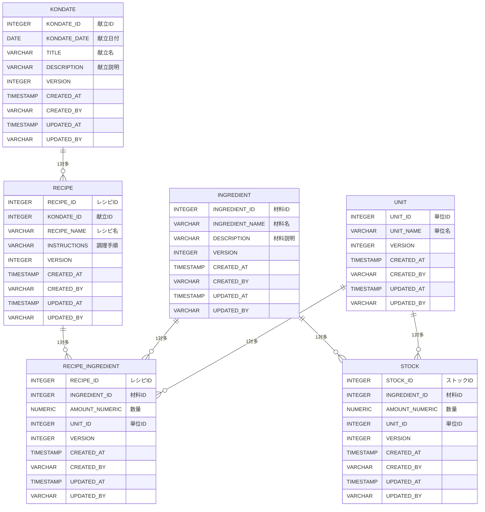

```mermaid
erDiagram
    %% 献立テーブル
    KONDATE {
        INTEGER KONDATE_ID "献立ID"
        DATE KONDATE_DATE "献立日付"
        VARCHAR TITLE "献立名"
        VARCHAR DESCRIPTION "献立説明"
        INTEGER VERSION
        TIMESTAMP CREATED_AT
        VARCHAR CREATED_BY
        TIMESTAMP UPDATED_AT
        VARCHAR UPDATED_BY
    }

    %% レシピテーブル
    RECIPE {
        INTEGER RECIPE_ID "レシピID"
        INTEGER KONDATE_ID "献立ID"
        VARCHAR RECIPE_NAME "レシピ名"
        VARCHAR INSTRUCTIONS "調理手順"
        INTEGER VERSION
        TIMESTAMP CREATED_AT
        VARCHAR CREATED_BY
        TIMESTAMP UPDATED_AT
        VARCHAR UPDATED_BY
    }

    %% 材料テーブル
    INGREDIENT {
        INTEGER INGREDIENT_ID "材料ID"
        VARCHAR INGREDIENT_NAME "材料名"
        VARCHAR DESCRIPTION "材料説明"
        INTEGER VERSION
        TIMESTAMP CREATED_AT
        VARCHAR CREATED_BY
        TIMESTAMP UPDATED_AT
        VARCHAR UPDATED_BY
    }

    %% 単位マスタ
    UNIT {
        INTEGER UNIT_ID "単位ID"
        VARCHAR UNIT_NAME "単位名"
        INTEGER VERSION
        TIMESTAMP CREATED_AT
        VARCHAR CREATED_BY
        TIMESTAMP UPDATED_AT
        VARCHAR UPDATED_BY
    }

    %% レシピ材料（中間テーブル）
    RECIPE_INGREDIENT {
        INTEGER RECIPE_ID "レシピID"
        INTEGER INGREDIENT_ID "材料ID"
        NUMERIC AMOUNT_NUMERIC "数量"
        INTEGER UNIT_ID "単位ID"
        INTEGER VERSION
        TIMESTAMP CREATED_AT
        VARCHAR CREATED_BY
        TIMESTAMP UPDATED_AT
        VARCHAR UPDATED_BY
    }

    %% 在庫テーブル
    STOCK {
        INTEGER STOCK_ID "ストックID"
        INTEGER INGREDIENT_ID "材料ID"
        NUMERIC AMOUNT_NUMERIC "数量"
        INTEGER UNIT_ID "単位ID"
        INTEGER VERSION
        TIMESTAMP CREATED_AT
        VARCHAR CREATED_BY
        TIMESTAMP UPDATED_AT
        VARCHAR UPDATED_BY
    }

    %% 関係
    KONDATE ||--o{ RECIPE : "1対多"
    RECIPE ||--o{ RECIPE_INGREDIENT : "1対多"
    INGREDIENT ||--o{ RECIPE_INGREDIENT : "1対多"
    UNIT ||--o{ RECIPE_INGREDIENT : "1対多"
    INGREDIENT ||--o{ STOCK : "1対多"
    UNIT ||--o{ STOCK : "1対多"
```
